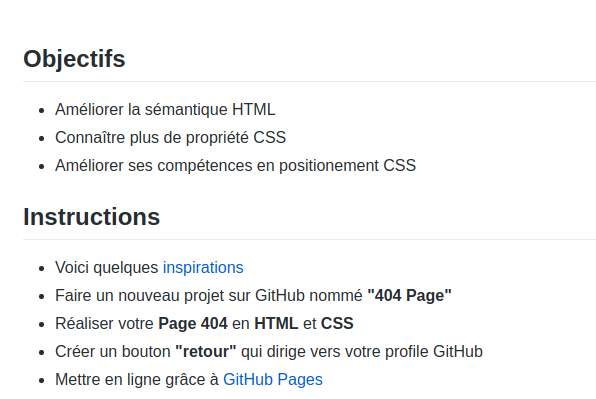

# 404-page

## Time-line
Cet exercice a été réalisé tout au début de ma formation, après 2 semaines.

## _Consignes de l'exercice:_ 

 
## Editeur de texte utilisé pour coder:
Visual Studio Code

## Langages utilisés:
- HTML
- CSS  

## Responsive? 
Bien évidemment!
